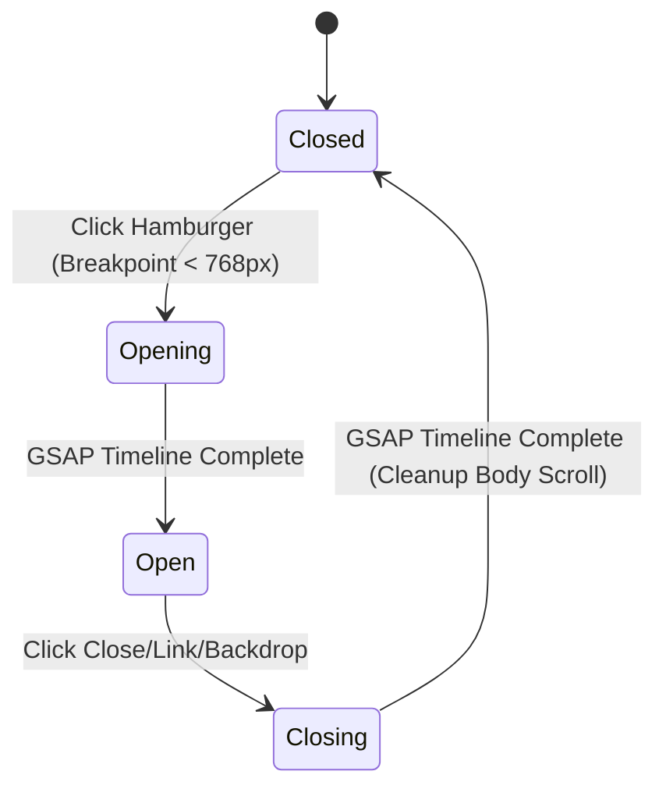

# Data Model: Full Mobile Navigation Modal

## UI State: Navigation Context

The mobile navigation modal is controlled by a set of transient UI states managed in `Navbar.jsx` (or a global state if shared).

| State | Type | Description |
|-------|------|-------------|
| `isMenuOpen` | boolean | Controls the visibility of the mobile overlay. |
| `isAnimating` | boolean | Prevents redundant triggers during transition. |

## Entity: NavLink

The modal will iterate over a collection of navigation links.

| Field | Type | Description |
|-------|------|-------------|
| `label` | string | Display name (e.g., "Oferta"). |
| `href` | string | Destination URL or Hash. |
| `isCTA` | boolean | If true, applies distinct styling (Social Olive accent). |

## Canonical Link Set
- **Start** (`/`)
- **Oferta** (`/oferta`)
- **O mnie** (`/o-mnie`)
- **Obszar dojazdu** (`/obszar-dojazdu`)
- **FAQ** (`/faq`)
- **Zarezerwuj masaż** (CTA)

## State Transitions

